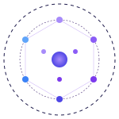
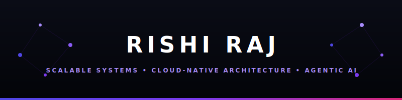

<p align="center">
  
</p>

<p align="center">
  
</p>

<p align="center">
  
  <a href="mailto:rishiraj02989@gmail.com"></a>
  <a href="https://www.linkedin.com/in/rishi-raj821/"></a>
  <a href="https://github.com/RishiRaj1100"></a>
</p>

<p align="center">
  
  
  
</p>

---

### 👤 About Me

I'm a Computer Science undergraduate with a strong passion for building scalable software systems, cloud-native applications, and AI-powered solutions. My primary interests lie in Backend Engineering, DevOps, Cloud Computing, Distributed Systems, and Agentic AI — I enjoy transforming complex ideas into efficient, reliable, production-ready applications.

My technical foundation includes Java, Spring Boot, Python, PostgreSQL, Redis, Docker, and modern CI/CD practices. I continuously sharpen my problem-solving through Data Structures & Algorithms while exploring system design, microservices, cloud architecture, and AI frameworks like LangChain and LangGraph.

I believe great engineering isn't just about writing code — it's about designing secure, maintainable, high-performance systems that solve meaningful problems. My long-term goal is to build large-scale products, lead engineering initiatives, and contribute to technologies that positively impact millions of users worldwide.

**Open To:** Internships · Open Source Collaboration · Backend / Cloud / AI Engineering Roles

> 🎯 Build world-class products · Contribute to open source · Design software at global scale

---

### 💻 Tech Stack

**Languages**
<p align="left">
  
  
  
  
</p>

**Backend & Frameworks**
<p align="left">
  
  
  
  
  
  
  
  
</p>

**Databases & Caching**
<p align="left">
  
  
  
  
</p>

**Frontend** *(supporting, not primary)*
<p align="left">
  
  
  
</p>

**Cloud & DevOps**
<p align="left">
  
  
  
  
  
  
  
</p>
<p><i>*(actively building production experience — see projects below)*</i></p>

**AI & ML**
<p align="left">
  
  
  
  
  
  
  
  
</p>

**Tools & Workflow**
<p align="left">
  
  
  
  
  
  
  
  
  
</p>

<p align="center">
  
</p>

---

### 🧠 AI / ML Expertise

| Domain | Proficiency | Details |
| :--- | :--- | :--- |
| **Agentic AI & Orchestration** | Advanced (Learning & Building) | Developing multi-agent systems using **LangChain** and **LangGraph** for autonomous task execution and memory-state management. |
| **Machine Learning** | Intermediate | Predictive modeling, classification, and regression using **Scikit-learn** and **XGBoost**. |
| **Vector Search & RAG** | Intermediate | Implementing semantic search and Retrieval-Augmented Generation workflows with **FAISS** vector database. |
| **Data Science Foundation** | Advanced | Data preprocessing, analysis, and manipulation using **Pandas**, **NumPy**, and scientific computing libraries. |

---

### 🚀 Featured Projects

<details open>
<summary><b>🔗 URL Shortener with Click Analytics</b></summary>
<br />

<table>
<tr>
<td>
<h3>🔗 URL Shortener with Click Analytics</h3>
<p>A production-grade URL shortening platform with QR code generation, click tracking, and an analytics dashboard showing device, browser, and geographic breakdowns.</p>

| Metric / Aspect | Details |
| :--- | :--- |
| **Stack** | Java · Spring Boot · Spring Security · Spring Data JPA · PostgreSQL · Redis · Flyway · ZXing · React · Tailwind CSS · JWT · Bucket4j |
| **Scale** | Multi-user support with JWT authentication and rate-limiting to prevent resource abuse. |
| **Performance** | Cache-aside pattern via Redis reduces database load; asynchronous click logging via Spring `@Async` ensures zero redirect latency. |
| **Security** | Rate-limited shorten endpoints using Token Bucket algorithm (Bucket4j); secure password hashing and JWT-based session management. |
| **Impact** | Fully automated redirection pipeline that handles high-throughput analytics tracking concurrently. |

**Key Highlights:**
- **Base62 Encoding:** Hash-based short code generation with base62 encoding and collision-retry logic.
- **Cache-Aside Pattern:** Redis integration to cache redirect mappings, falling back to PostgreSQL only on cache misses.
- **Asynchronous Click Analytics:** Spring `@Async` processes geolocation lookup and browser/device parsing in the background without delaying user redirects.
- **API Rate Limiting:** JWT-secured user accounts protected by Bucket4j rate-limiting.
- **Interactive Dashboard:** Frontend powered by React and Recharts showing clicks over time, device/browser distributions, and geographic breakdowns.

<p align="right">
  <a href="https://github.com/RishiRaj1100">📂 Repository</a>
</p>
</td>
</tr>
</table>
</details>

<br />

<details open>
<summary><b>📲 QR-Based Event Check-In System</b></summary>
<br />

<table>
<tr>
<td>
<h3>📲 QR-Based Event Check-In System</h3>
<p>A full-stack event management platform where attendees receive HMAC-signed QR tickets and organizers verify entry through a real-time scanning dashboard with WebSocket-powered live sync.</p>

| Metric / Aspect | Details |
| :--- | :--- |
| **Stack** | Java · Spring Boot · Spring Security · Spring WebSocket · STOMP · Spring Data JPA · PostgreSQL · Flyway · ZXing · JWT · HMAC-SHA256 · Bucket4j · React · Tailwind CSS · html5-qrcode |
| **Scale** | Handles concurrent scans efficiently via database-level atomic transitions and stateless ticket validation. |
| **Performance** | Stateless HMAC verification bypasses database lookups during code scans, minimizing check-in processing time. |
| **Security** | Cryptographically signed tickets using HMAC-SHA256 prevent ticket tampering and forgery. Rate-limited public registration. |
| **Impact** | Streamlines event check-in operations with real-time feedback loops and sub-second response times. |

**Key Highlights:**
- **HMAC-Signed Tickets:** Attendee ID and Event ID are encoded into a tamper-evident token, allowing offline or DB-less validation.
- **Atomic Check-In:** Employs atomic database updates (`UPDATE ... WHERE status = REGISTERED`) to guarantee check-ins are processed exactly once under high concurrency.
- **Real-Time Live Sync:** Spring WebSocket + STOMP updates all connected organizer scanning devices immediately upon a ticket scan.
- **Rate-Limited Public Registration:** Unauthenticated registration endpoints are rate-limited to mitigate spam signups.

<p align="right">
  <a href="https://github.com/RishiRaj1100">📂 Repository</a>
</p>
</td>
</tr>
</table>
</details>

---

### 💼 Experience

| Period | Role | Organization |
| :--- | :--- | :--- |
| **June 2025 – July 2025**<br />*(6 weeks)* | **AI & Machine Learning Intern** | **Edunet Foundation** *(in collaboration with AICTE)* |

**Scope of Work:**
- Built and evaluated ML models (classification/regression) as part of a structured AI/ML training program implemented under AICTE's industry collaboration initiative.
- Applied end-to-end ML workflow: data preprocessing, feature engineering, model selection, and evaluation using Python and Scikit-learn.

**Skills Utilized:**
`Python` · `Machine Learning` · `Scikit-learn` · `Data Preprocessing` · `Model Evaluation`

---

### 🎯 Coding Profiles

<p align="center">
  <a href="https://leetcode.com/u/RishiRaj1100/"></a>
</p>

---

### 🎯 Current Focus

```yaml
current_focus:
  learning:
    - "Distributed Systems & System Design"
    - "Spring Cloud & Microservices Architecture"
    - "Kubernetes & Container Orchestration"
    - "AWS Cloud Practitioner → Solutions Architect path"
    - "LangChain & Agentic AI Frameworks"
  building:
    - "URL Shortener with Click Analytics (Spring Boot + Redis + PostgreSQL)"
    - "QR-Based Event Check-In System (Spring Boot + WebSocket + JWT)"
  exploring:
    - "Apache Kafka for event-driven architectures"
    - "OpenTelemetry for distributed tracing"
    - "LangGraph for multi-agent AI orchestration"
  open_to:
    - "Software Engineering Internships (Backend / Cloud / Full-Stack)"
    - "Open Source Collaboration (Java / Spring / AI)"
    - "Research & Build projects with strong engineers"
```

---

### 🤝 Connect With Me

<p align="center">
  <a href="mailto:rishiraj02989@gmail.com"></a>
  <a href="https://www.linkedin.com/in/rishi-raj821/"></a>
  <a href="https://github.com/RishiRaj1100"></a>
</p>

---

<p align="center">
  <i>"Clean code always looks like it was written by someone who cares." — Robert C. Martin</i>
</p>

<p align="center">
  
</p>
